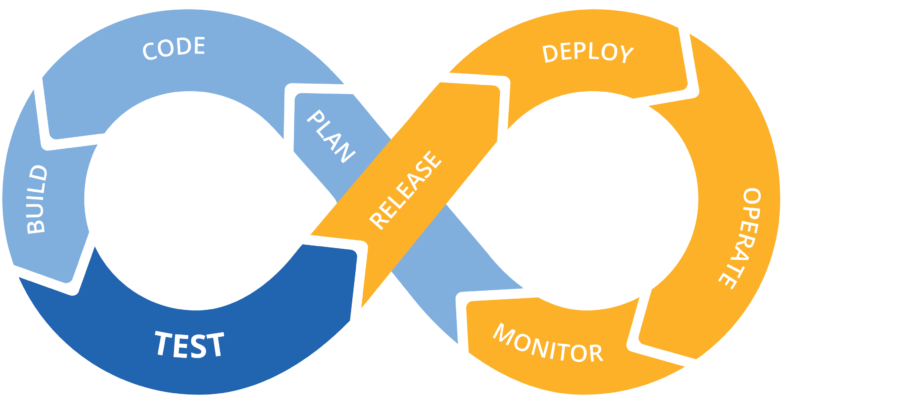

Test project of Github actions applied to a Data Science project

https://towardsdatascience.com/rethinking-continuous-integration-for-data-science-ebf0dfc61788

# Wine quality prediction
Modelling a Kaggle dataset of [red wine properties and quality ratings](https://www.kaggle.com/uciml/red-wine-quality-cortez-et-al-2009). 
